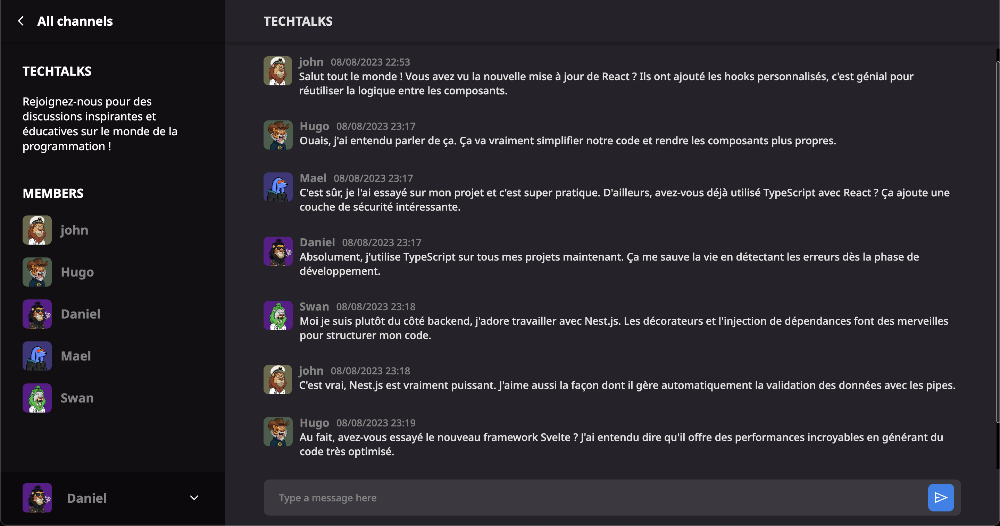

# Chat Group

Chat Group est une application web qui permet aux utilisateurs de chatter en temps réel.

Ce projet fait partie des défis propose par le site [DevChallenges](https://devchallenges.io/challenges/UgCqszKR7Q7oqb4kRfI0).

## Fonctionnalités

- Communication en temps réel avec d'autres utilisateurs dans les channels
- Rejoindre des channel existants
- Créer de nouveaux channels

## Technologies Utilisées

### Backend

- Typescript
- Nest.js
- Socket.io
- TypeORM
- MySQL
- AWS RDS pour l'hébergement de la base de données
- AWS EC2 pour le déploiement du backend

### Frontend

- Typescript
- React
- SCSS
- AWS S3 pour le déploiement du frontend

## Aperçu

